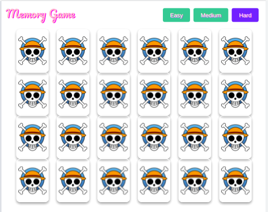

[Go to live app](https://assignment-better-self-today.vercel.app/)

# Simple flipping card game
The Memory Game is a simple yet engaging card flipping and matching game created using VueJs. It was created as part of an assignment to demonstrate key web development skills.

# Setup Locally

1. Clone the repository: `git clone https://github.com/amuwal/assignment-better-self-today`
2. Navigate to the project directory: `cd assignment-better-self-today`
3. Install dependencies: `npm i`
4. Run the project locally: `npm run dev`
5. Access the application in your browser: [http://localhost:5173](http://localhost:5173)

## Features

 The app currently supports the following features:

* Change Levels
